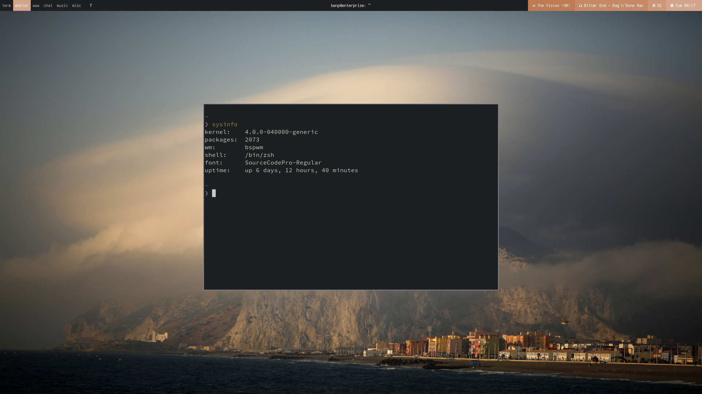

# dotfiles

These are my dotfiles. Currently:

* WM: bspwm
* Term: urxvt (256 colour)
* Panel: bar
* Notification daemon: dunst

Running on:
```sh
$ cat /etc/lsb-release
DISTRIB_ID=Ubuntu
DISTRIB_RELEASE=15.04
DISTRIB_CODENAME=vivid
DISTRIB_DESCRIPTION="Ubuntu 15.04"
```



Maintained with [robertdolca/dotfiles-manager](https://github.com/robertdolca/dotfiles-manager)
